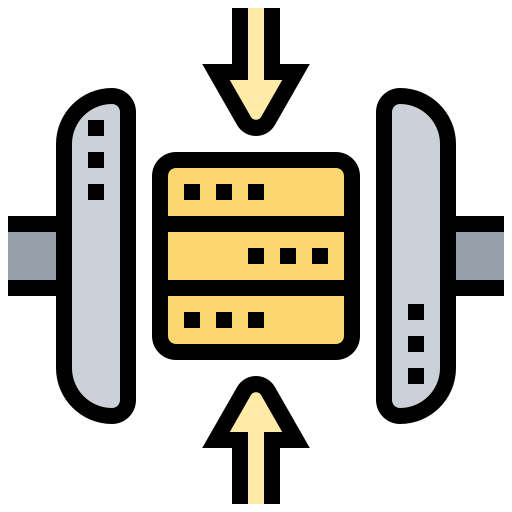
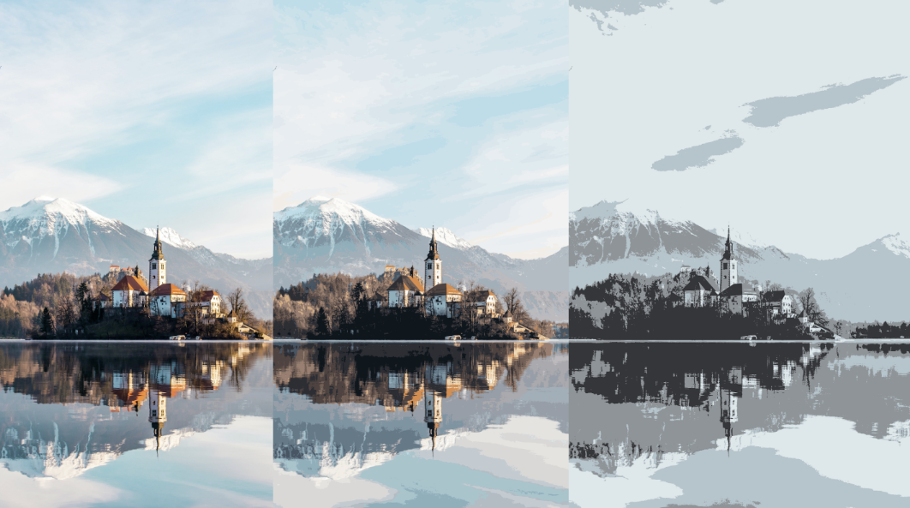

<a name="readme-top"></a>


[![Contributors][contributors-shield]][contributors-url]
[![Forks][forks-shield]][forks-url]
[![Stargazers][stars-shield]][stars-url]
[![Issues][issues-shield]][issues-url]
[![MIT License][license-shield]][license-url]
[![LinkedIn][linkedin-shield]][linkedin-url]


<!-- PROJECT LOGO -->
<br />
<div align="center">
  <a href="https://github.com/FallingLights/Simple-Image-Compression">
    
  </a>

<h3 align="center">Image Compression using K-Means Algorithm</h3>

    A simple image compression algorithm using K-Means algorithm.

</div>


<!-- TABLE OF CONTENTS -->
<details>
  <summary>Table of Contents</summary>
  <ol>
    <li>
      <a href="#about-the-project">About The Project</a>
      <ul>
        <li><a href="#built-with">Built With</a></li>
      </ul>
    </li>
    <li>
      <a href="#getting-started">Getting Started</a>
      <ul>
        <li><a href="#prerequisites">Prerequisites</a></li>
        <li><a href="#installation">Installation</a></li>
      </ul>
    </li>
    <li><a href="#usage">Usage</a></li>
    <li><a href="#contributing">Contributing</a></li>
    <li><a href="#license">License</a></li>
    <li><a href="#contact">Contact</a></li>
    <li><a href="#acknowledgments">Acknowledgments</a></li>
  </ol>
</details>


<!-- ABOUT THE PROJECT -->
## About The Project

<div align="center">
    
</div>

Simple Image Compression is a simple image compression algorithm using [K-Means algorithm](https://en.wikipedia.org/wiki/K-means_clustering). The project was created as research into the speedup achievable by using the GPU to perform the K-Means algorithm. The project is written in C and uses the [OpenCL](https://www.khronos.org/opencl/) library, [OpenMP](https://www.openmp.org/) API and [STB-Image](https://github.com/nothings/stb) Libraries for reading and writing the images .

<p align="right">(<a href="#readme-top">back to top</a>)</p>


### Built With

* C
* OpenCL
* OpenMP
* STB-Image

<p align="right">(<a href="#readme-top">back to top</a>)</p>


<!-- GETTING STARTED -->
## Getting Started

### Prerequisites

Things you will need to install the software and how to install them.
* C
    ```sh
    sudo apt-get install build-essential
    ```
* gcc
    ```sh
    sudo apt-get install gcc
    ```
* OpenCL
  ```sh
  sudo apt install opencl-headers
  ```
* OpenMP
  ```sh
  sudo apt install libomp-dev
  ```


### Installation

1. Clone the repository
   ```sh
   git clone https://github.com/FallingLights/Simple-Image-Compression.git
2. Install all the prerequisites listed above
3. Run the makefile
    ```sh
    make
    ```
4. Run the program

<p align="right">(<a href="#readme-top">back to top</a>)</p>


<!-- USAGE EXAMPLES -->
## Usage

More details on how to use the programs can be found in the source files.


<!-- CONTRIBUTING -->
## Contributing

Contributions are what make the open source community such an amazing place to learn, inspire, and create. Any contributions you make are **greatly appreciated**.

If you have a suggestion that would make this better, please fork the repo and create a pull request. You can also simply open an issue with the tag "enhancement".
Don't forget to give the project a star! Thanks again!

1. Fork the Project
2. Create your Feature Branch (`git checkout -b feature/AmazingFeature`)
3. Commit your Changes (`git commit -m 'Add some AmazingFeature'`)
4. Push to the Branch (`git push origin feature/AmazingFeature`)
5. Open a Pull Request

<p align="right">(<a href="#readme-top">back to top</a>)</p>


<!-- LICENSE -->
## License

Distributed under the MIT License. See `LICENSE.txt` for more information.

<p align="right">(<a href="#readme-top">back to top</a>)</p>


<!-- CONTACT -->
## Contact

Your Name - [@fallinglight_s](https://twitter.com/@fallinglight_s) - fallinglights@protonmail.com

Project Link: [https://github.com/FallingLights/Simple-Image-Compression](https://github.com/FallingLights/Simple-Image-Compression)

<p align="right">(<a href="#readme-top">back to top</a>)</p>


<!-- ACKNOWLEDGMENTS -->
## Acknowledgments

* [Uornca](https://github.com/Uornca)

<p align="right">(<a href="#readme-top">back to top</a>)</p>


<!-- MARKDOWN LINKS & IMAGES -->
<!-- https://www.markdownguide.org/basic-syntax/#reference-style-links -->
[contributors-shield]: https://img.shields.io/github/contributors/FallingLights/Simple-Image-Compression.svg?style=for-the-badge
[contributors-url]: https://github.com/FallingLights/Simple-Image-Compression/graphs/contributors
[forks-shield]: https://img.shields.io/github/forks/FallingLights/Simple-Image-Compression.svg?style=for-the-badge
[forks-url]: https://github.com/FallingLights/Simple-Image-Compression/network/members
[stars-shield]: https://img.shields.io/github/stars/FallingLights/Simple-Image-Compression.svg?style=for-the-badge
[stars-url]: https://github.com/FallingLights/Simple-Image-Compression/stargazers
[issues-shield]: https://img.shields.io/github/issues/FallingLights/Simple-Image-Compression.svg?style=for-the-badge
[issues-url]: https://github.com/FallingLights/Simple-Image-Compression/issues
[license-shield]: https://img.shields.io/github/license/FallingLights/Simple-Image-Compression.svg?style=for-the-badge
[license-url]: https://github.com/FallingLights/Simple-Image-Compression/blob/master/LICENSE
[linkedin-shield]: https://img.shields.io/badge/-LinkedIn-black.svg?style=for-the-badge&logo=linkedin&colorB=555
[linkedin-url]: https://linkedin.com/in/aleksander-gomilšek
[C]: https://img.shields.io/badge/c-%2300599C.svg?style=for-the-badge&logo=c&logoColor=white
[C++]: https://img.shields.io/badge/c++-%2300599C.svg?style=for-the-badge&logo=c%2B%2B&logoColor=white